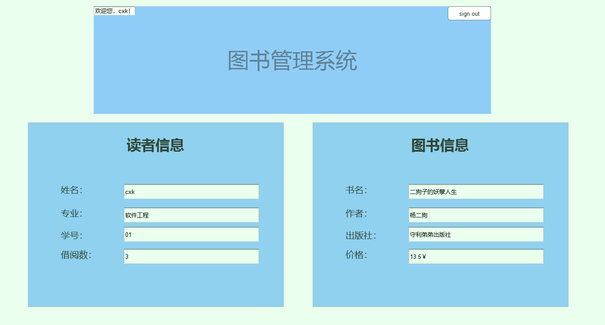

# 实验5：图书管理系统数据库设计与界面设计
|学号|班级|姓名|照片|
|:-------:|:-------------: | :----------:|:---:|
|201510414319|软件(本)15-3|吴宇峰||

## 1.数据库表设计

## 1.1. 图书表
|字段|类型|长度|主键，外键|可以为空|默认值|约束|说明|
|:-------:|:-------|:-------------:|:------:|:----:|:---:|:----:|:-----|
|ISBN|vachar|20|主键|否||||
|Name|varchar|100| |否||||
|Press|varchar|5|  |否 ||||
|author|varchar|12| |否||||

## 1.2. 用户信息表
|字段|类型|长度|主键，外键|可以为空|默认值|约束|说明|
|:-------:|:-------|:-------------:|:------:|:----:|:---:|:----:|:-----|
|ID|Int|20|主键|否||||
|Name|varchar|15| |否||||
|SEX|varchar|2| |否||||

***

## 2. 界面设计
## 2.1. 借书界面设计
[]

- 用例图参见：借书用例
- 类图参见：借出图书类
- 顺序图参见：借出顺序图
- API接口如下：

1. 接口调用请求说明

- 功能：用于获取全部分类
- 支持格式:json/xml
- 请求地址：http://api.yi18.net/book/bookclass
- 请求示例:请求示例：http://api.yi18.net/book/search?keyword=资本论
- 请求方法：GET
- 请求参数： Allow

|参数名称|必填|说明|
|:-------:|:-------------: | :----------:|
|access_token|是|用于验证请求合法性的认证信息。 |
|method|是|固定为 “GET”|

- 返回实例：
```
{
       {  
       "resultcode":"200",  
       "reason":"Success",  
       "result":{  
       "data":[  
         {  
            "title":"杨二狗的妖孽人生",  
            "catalog":"社会 哲学 文学 ",  
            "tags":"二狗子的一声 ",  
            "sub1":"《杨二狗的妖孽人生》",  
            "sub2":"《杨二狗的妖孽人生》作者是杨二狗，首版出版于2018年5月7日",  
            "reading":"8091人阅读",  
            "online":"京东商城:http://book.jd.com/20587462876.html 
            "bytime":"2018年4月28日"  
          }  
        ],  
       "totalNum":"9",  
       "pn":0,  
       "rn":"1"  
        }  
       }  
```
- 返回参数说明：
    
|参数名称|说明|
|:-------:|:-------------: |
|result|返回信息|
|data|获取的图书信息|
|200|返回码|
