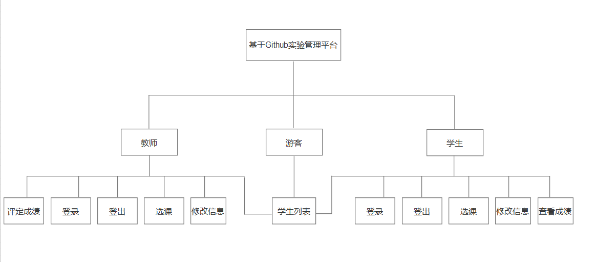
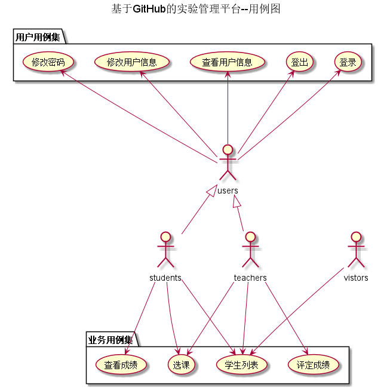
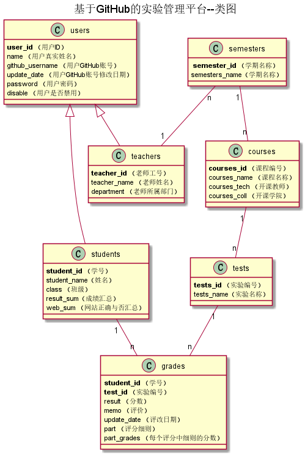

<!-- markdownlint-disable MD033-->
<!-- 禁止MD033类型的警告 https://www.npmjs.com/package/markdownlint -->

# 基于GitHub的实验管理平台的分析与设计

### 成都大学信息科学与工程学院

|学号|班级|姓名|照片|
|:-------:|:-------------: | :----------:|:---:|
|201510414319|软件(本)15-3|吴宇峰||

## 1. 概述
- 基于GitHub的实验管理平台的作用是在线管理实验成绩的Web应用系统。学生和老师的实验内容均存放在GitHUB
页面上。
- 学生的功能主要有：一是设置自己的GitHub用户名，二是查询自己的实验成绩。学生的GitHub用户名是公开的，但成绩不公开。
- 老师的功能主要有：一是批改每个学生的成绩，二是查看每个学生的成绩。
- 老师和学生都能通过本系统的链接方便地跳转到学生的每个GitHUB实验目录，以便批改实验或者查看实验情况。
- 实验成绩按数字分数计算，每项实验的满分为100分，最低为0分。
- 系统自动计算每个学生的所有实验的平均分。
- 一个老师可以上多门课，每个老师只能维护老师自己的课程及成绩。
- 一人同学可以上多门课，每个同学只能查询同学自己的课程的实验成绩。
- 老师和同学都可以选多门课程，但必须是老师先选，学生后选。
- 每个实验的实验成绩细分为多个评分项，每个评分项对应各自的评分标准。
## 2. 系统总体结构

    
## 3. 用例图设计 [源码](src/UseCase.puml)

## 4. 类图设计 [源码](src/class.puml)

## 5. 数据库设计
- ### [参见数据库设计](./数据库设计.md)

## 6. 用例及界面详细设计
- ### [“学生列表”用例](./用例/学生列表.md),[界面](https://github.com/wuyufeng123/is_analysis/blob/master/test6/学生列表界面设计.png)
- ### [“评定成绩”用例](./用例/评定成绩.md),[界面](https://github.com/wuyufeng123/is_analysis/blob/master/test6/评定成绩界面设计.png)
- ### [“查看成绩”用例](./用例/查看成绩.md),[界面](https://github.com/wuyufeng123/is_analysis/blob/master/test6/查看成绩界面设计.png)
- ### [“修改密码”用例](./用例/修改密码.md),[界面](https://github.com/wuyufeng123/is_analysis/blob/master/test6/修改密码界面设计.png)
- ### [“修改用户信息”用例](./用例/修改用户信息.md),[界面](https://github.com/wuyufeng123/is_analysis/blob/master/test6/修改用户信息界面设计.png)
- ### [“查看用户信息”用例](./用例/查看用户信息.md),[界面](https://github.com/wuyufeng123/is_analysis/blob/master/test6/查看用户信息界面设计.png)
- ### [“登出”用例](./用例/登出.md),[界面](https://github.com/wuyufeng123/is_analysis/blob/master/test6/登出界面设计.png)
- ### [“登录”用例](./用例/登录.md),[界面](https://github.com/wuyufeng123/is_analysis/blob/master/test6/登录界面设计.png)
- ### [“学生选课”用例](./用例/学生选课.md),[界面](https://github.com/wuyufeng123/is_analysis/blob/master/test6/学生选课界面设计.png)
- ### [“教师选课”用例](./用例/教师选课.md),[界面](https://github.com/wuyufeng123/is_analysis/blob/master/test6/教师选课界面设计.png)
