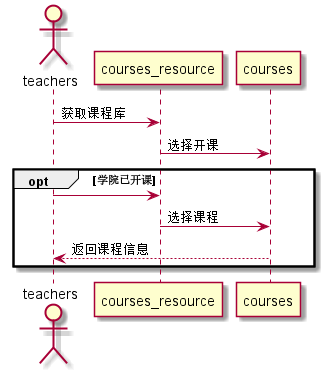
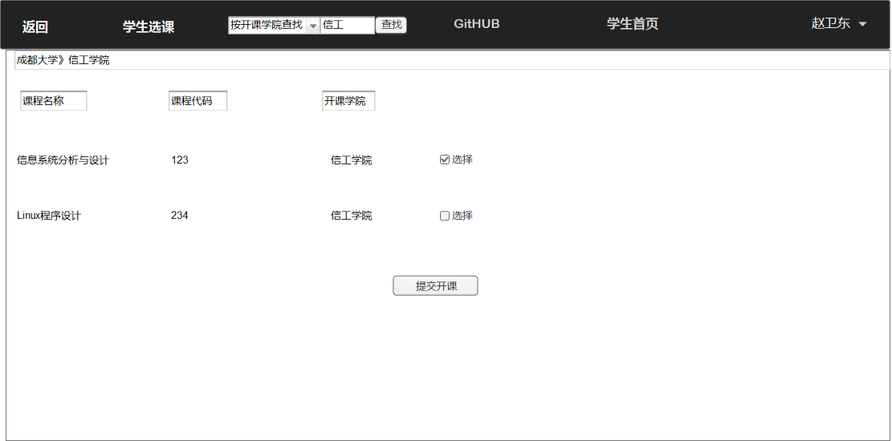

<!-- markdownlint-disable MD033-->
<!-- 禁止MD033类型的警告 https://www.npmjs.com/package/markdownlint -->

# “教师选课”用例 [返回](../README.md)
## 1. 用例规约

|用例名称|教师选课|
|-------|:-------------|
|功能|选择课程|
|参与者|教师|
|前置条件|必须先登录|
|后置条件|老师必须先选了这么课后，其学生才能选|
|主事件流|老师勾选要开的课程后，确认选课|
|备选事件流|在老师没有开的课程里，不能选择课程|

## 2. 业务流程（顺序图） [源码](../src/sequence教师选课.puml)
 
## 3. 界面设计
 
- API接口调用
    - 接口1：[setTeacherCourses](../接口/setTeacherCourses.md)

## 4. 算法描述 
   - 无
## 5. 参照表
- [COURSES](../数据库设计.md/COURSES)
- [SEMESTERS](../数据库设计.md/SEMESTERS)

